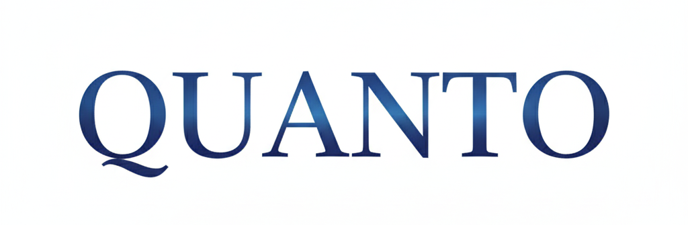

  

# 🌌 QUANTO

 LLM-Driven Autonomous Trading Framework
Quanto is a sophisticated algorithmic trading framework designed to bridge the gap between Large Language Model (LLM) reasoning and systematic market execution. By synthesizing multi-timeframe market intelligence with a high-fidelity control engine, Quanto enables a complete "Perception-Inference-Execution" loop for digital assets.

## 🎯 Vision
The core mission of Quanto is to eliminate human emotional bias by leveraging the semantic analytical power of LLMs. It interprets complex market regimes and translates them into disciplined, risk-managed trading operations.

## 🛠️ System Architecture
Quanto is built on a decoupled, data-driven architecture which ensures both cognitive depth and execution speed:

- Alpha: A multi-agent system that processes diverse data streams to establish directional bias and optimal entry/exit timing.

- Gamma: A robust state-machine responsible for the trade lifecycle, managing risk constraints and automated escape mechanisms.

- Executor: A high(will be)-performance bridge ensuring reliable, low-latency interaction with exchange infrastructures.

## ⚠️ Disclaimer
This project is for research and educational purposes only. Algorithmic trading involves significant risk of financial loss. The developers of Quanto assume no responsibility for any financial outcomes resulting from the use of this software.

## 📜 License
This project is licensed under the Creative Commons Attribution-NonCommercial-NoDerivatives 4.0 International **(CC BY-NC-ND 4.0)**.

## 📧 Contact
For commercial licensing inquiries, private deployment requests, or partnership opportunities, please contact the maintainer directly through the repository's contact channels.